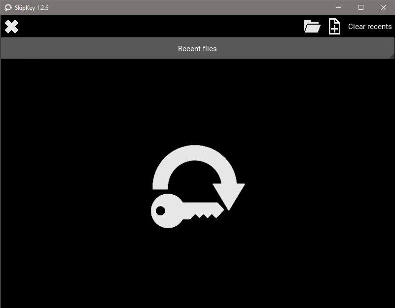
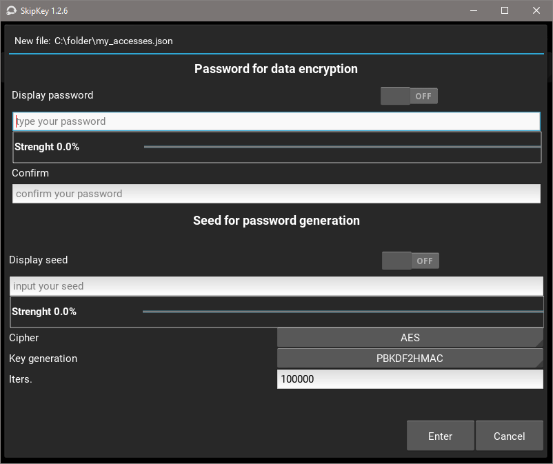
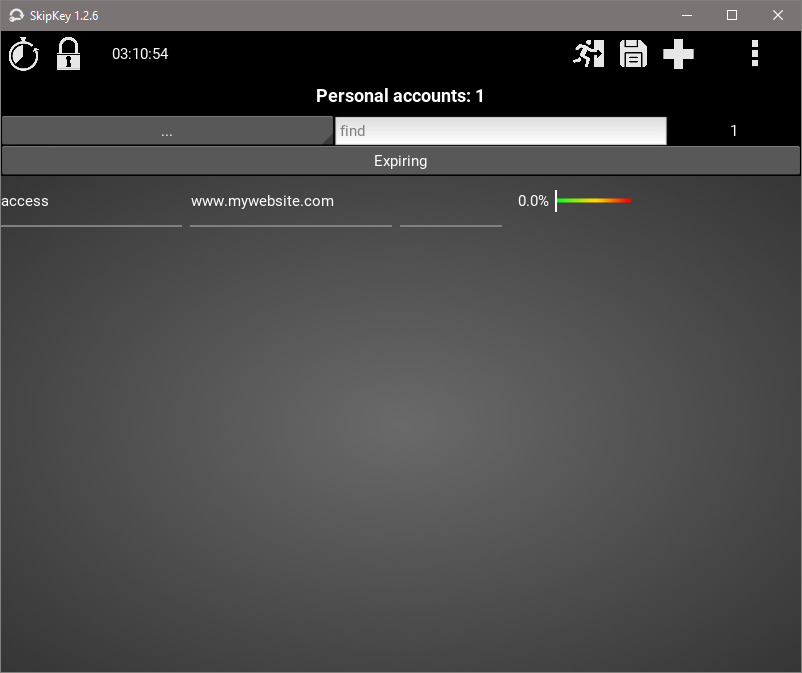
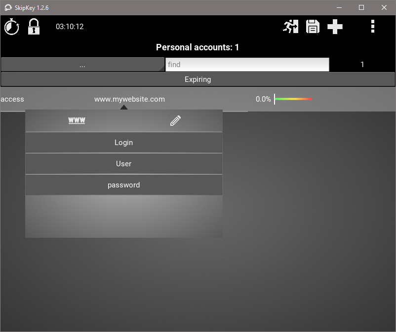
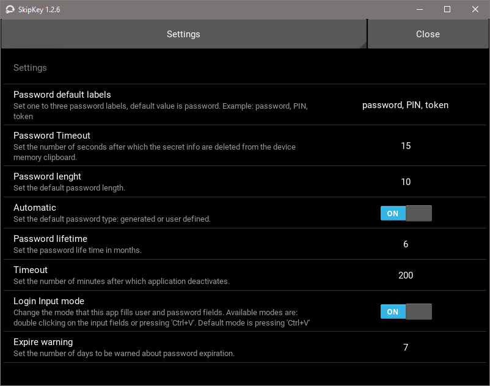
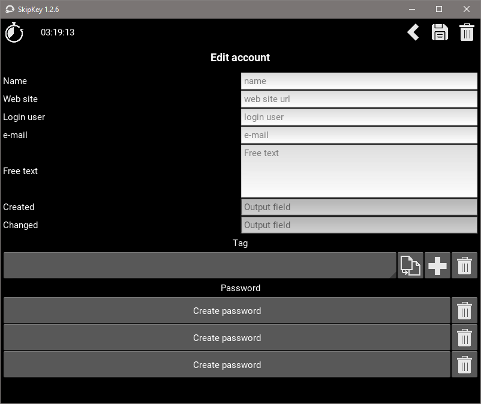
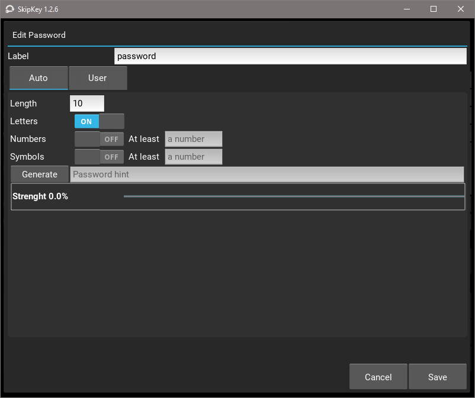
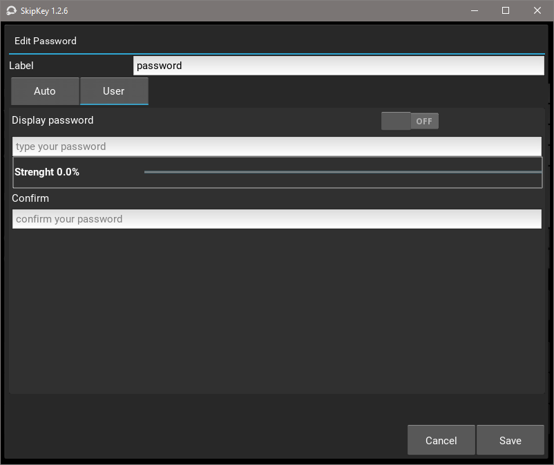

# SkipKey, a program for personal password management

author: Franco Toninato

SkipKey is a simple program for personal password management developed in python with [kivy](https://kivy.org "Kivy") graphical user interface.
The design principles are:
- a password for encrypting the file containing all user passwords,
- a user 'casual code' (like a password) to derive passwords automatically (if the password 'mode'preference is set to 'auto'), or to encrypt user defined passwords.
BOTH *password* and *casual `code`* are needed and must be remembered by the user: the password is responsible of protecting the file, the casual code is responsible of password generating ('auto' mode) or encrypting ('user' mode).
To enhance security no checks was implemented on password or casual code input.

The strenght of this program is fully exploited when user choses to have only generated passwords.
To be more precise the cryptographic secrets are always derived by user password or casual code through one of the recommended algorithms (PBKDF2).
During a program run the secret keys are wrapped by temporary random keys valid only for one that run: this increases security against reading the memory in the attempt of stealing them.

## How to lauch the app
After cloning the repository the app is launched by:

	$python3>main.py
or

	$python3>skipkey.py

### GUI and dependencies
Make sure you have the following python modules installed in your python environment:
* [kivy](https://kivy.org "Kivy"), graphycal user interface,
* See the <a href='requirements.txt'>requirements.txt</a> file.

## Enter screen

It is the screen you see when start app: on the right corner there are file operations: **open**, **create**, **quit**, **delete recent files**. The list of recently opened files is available clicking on the **recent files** drop-down.

### Open/Create a new file
The **open button** allow you to open an existing file. 
### Login to an existing file
It is the popup where user must input *password* and the *seed for password generation*. When create a new file a password confirmation is requested. When opening an existing file and the password provided by the user isn't right, an error message is pop up to the user.
### Create a new file

To create a new file you must press the **create button** and enter the password you want for encrypting the file and the secret code you choose for encrypting or generating the passwords for all your accesses. 
## List screen

The list screen is the main screen and all app's available actions is addressed from there. From this screen you **add** your accounts and manage them. To **manage** an existing account you click on the item and select the option **edit**. From this screen you can:
* click on the **Timer** button to restart the countdown to the program stop;
* click on the **Locker** button to lock the app with a password you choose;
* a countdown clock starts when you enter the app and stop the app after the number of minutes set in the *settings* screen.

### List-screen: Info
Displays informations about the current file and security settings.
### List-screen: Changes
Provides the list of changes during the current program run. You can select the change and undo, please note that 'undo of undo' is not allowed.
### List-screen: Copy to
Copies the current content to another file. Before copying you must input a new password and a new casual code. This is the option to choose when you decide to change the encryption password and the secret code. A new encrypted file is generated and all existing passwords are converted to *user passwords* and encrypted by the new secret code.
### List-screen: Export to
Exports the content as a .csv file with password in plain text. This option can be useful if you decide to print a snapshot of all your accounts to save them into a secure place. Otherwise this option can be used to have a standard .csv file to feed another password management app.
### List-screen: Import from
Imports an existing list of accounts from another password management app. The imported file must be a .csv file with header. Before importing you must define the matching between the **skipkey** header and the **other app**'s one. 
### How to use your accounts

* Find the account you want to login into by writing few letters in the search field,
* click on the proper item, then a popup-menu will appear pointing to it. Here are many buttons: *Login* copies both user and password to the clipboard (or autocompletion tool): than you can paste (or double click) on the login panel.

* click on *User* to copy user;
* click on one of the three different *password* you can define for your access;
* click on *WWW* to open a browser tab pointing to the url defined for your access;
* click on *Edit* to edit your current access.

### Settings

By pressing 'F1' the app settings are displayed. At present you can change also 'Kivy' settings. Not all new values are effective on the current app run.

### Settings options:
All these options make the corresponding datum available in the memory and ready to be pasted into the target login field.
There are two option for app settings *Login auto-completion*:
* If _Disabled_ the login informations (user and password) are available to the system clipboard for a short time, then cleared.
* If _Enabled_ the login informations are available to the program memory and can be input to the target field by a double click on it, before being cleared.

## Edit screen

This is the screen you get when touches the **edit** button in the bubble menu over a specific access item in the *list* screen. Only the name and password fields are mandatory. The *name* is the key of the access item, so if you change it and save, a new identical account item will be created with the new name. To rename an item you must rename it and then delete the previous one.

## Accounts management
You can define up to three passwords for each account, this can be useful when you have both a password and a PIN and a RESET code. A password can be suggested by the app or user defined. In both cases a dynamic password gauge shows its estimated strength.

### Tag definition
You can associate a *Tag* to your account useful for filtering your records from the *List* screen. The tag can be deleted or changed globally from each account.

### Generated password screen

### User password screen

# More to do
## Installation checker
First time a file is opened or created an installation check is made and stored inside the file, hashing of installed files. In such a way the user can verify the installation integrity.

# On Windows systems:
In order to making skipkey available as an executable on Windows systems it is possible to compile it with [pyinstaller](https://www.pyinstaller.org/).

Here you are my packaging hint with pyinstaller to avoiding hassles:

Note:
If you use [conda](https://www.anaconda.com/) environments or python virtual environments please install pyinstaller into the environment of the app you want to package.
* Make a <my_project> directory in the environment you use for compiling the app by cloning the git repository.
* Make a <my_package> directory in the environment where you decided to have the compiled app.
* Open a terminal and change the current directory to the <my_package> 
* Activate your virtual environment
* Run `pyinstaller` utility from the **virtual environment** including the following <a href='skipkey.spec'>skipkey.spec</a> file.

